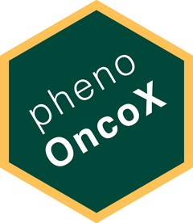

&nbsp;

## phenOncoX - crossmapped phenotype ontologies for cancer 

### Overview

An ontological definition of disease enables each type of disease to be 
singularly classified in a formalized structure. By intention, the use of 
disease ontology terms should facilitate a cross-link of information between 
separate disease-related knowledge resources for a given domain. 

However, multiple disease ontology frameworks have been developed for human 
disease (i.e. [OncoTree](http://oncotree.mskcc.org/#/home), 
[Experimental Factor Ontology (EFO)](https://github.com/EBISPOT/efo), 
[Disease Ontology (DO)](https://github.com/DiseaseOntology/HumanDiseaseOntology), [UMLS](https://www.ncbi.nlm.nih.gov/medgen/), [ICD-10)](https://www.who.int/standards/classifications/classification-of-diseases), 
and they are used to different extents across knowledge resources in the 
oncology domain, such as the following:

-   gene-disease associations
-   drug-disease indications
-   variant-disease associations

In order to integrate such knowledge resources, there is henceforth a need 
to cross-link or map the entries across disease ontologies to the extent it 
is possible.

**phenOncoX** is an R data package that attempts to address this challenge. 
In short, **phenOncoX** provides a global cross-mapped set of phenotype 
ontology terms attributed to cancer phenotypes.

The mapping established within **phenOncoX** is semi-manually curated, 
using [OncoTree](http://oncotree.mskcc.org/#/home) as the starting point 
for a list of [UMLS](https://www.ncbi.nlm.nih.gov/medgen/) phenotype terms per cancer 
subtype/primary site. Next, **phenOncoX** appends a number of phenotypes 
attributed to heritable cancer conditions. Furthermore, each cancer subtype 
entry in *OncoTree* is expanded with additional subtypes that are found in 
the *UMLS* child-parent hierarchy of disease terms.

For each entry in the final list of phenotype terms, we make cross-mappings 
with phenotype terms from [EFO](https://github.com/EBISPOT/efo), 
[DO](https://disease-ontology.org/), and 
the [ICD10 classification](https://www.who.int/standards/classifications/classification-of-diseases).

As of early February 2026, the following ontology versions are used to create the mapping:

-   OncoTree (2025_10_03)
-   Experimental Factor Ontology v3.86.0 (2026-01-15)
-   Disease Ontology (v2026-02-02)

**IMPORTANT NOTE**: The mapping established by **phenOncoX** attempts 
to be comprehensive, but we acknowledge that the presence of missing or 
erroneous cross-references might still occur.

### Getting started

* [Installation instructions](https://sigven.github.io/phenOncoX/articles/phenOncoX.html#installation)
* [Usage examples](https://sigven.github.io/phenOncoX/articles/phenOncoX.html#get-oncotree-terms)

### Contact

sigven AT ifi.uio.no
